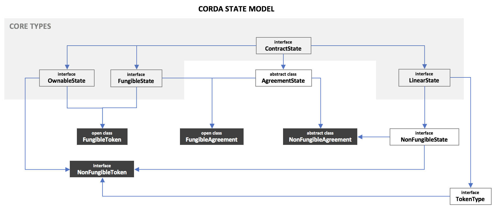

# Corda State Hierarchy Design

This paper describes a new approach to modelling tokens and agreements (financial things) on Corda. There are two key intuitions behind the model: 

1. The notion of "fungibility" can be an attribute of any state type, not just assets and/or ownable things
2. The lifecycle of an thing should be orthogonal to the notion of ownership of that thing

## Additions to the core data model

The current versions of `ContractState`, `OwnableState` and `LinearState` in Corda Core are used as they exist today. 

A new `FungibleState` is added for the following reasons:

* `FungibleAsset` defines an amount property of type `Amount<Issued<T>>`, therefore there is an assumption that all fungible things are issued by a single well known party but this is not always the case. For example, permissionless cryptocurrencies like Bitcoin are generated periodically by a pool of pseudo-anonymous miners and Corda can support such cryptocurrencies.
* `FungibleAsset` implements `OwnableState`, as such there is an assumption that all fungible things are ownable. This is not always true as fungible derivative contracts exist, for example.

The new `FungibleState` is simply defined as:

```kotlin
interface FungibleState<T : ThingPointer> : ContractState {
    val amount: Amount<T>
}
```

Where `ThingPointer` is a class which allows us to easily resolve a `linearId` to the underlying `StateAndRef`. The significance of `ThingPointer` will be explained below.

```kotlin
class ThingPointer<T : Thing>(val linearId: UniqueIdentifier) {
    fun resolve(services: ServiceHub): StateAndRef<T> {
    	TODO()
    }
}
```

`Thing` at a high-level is just a `LinearState`. However, one can imagine interfaces which cater to different classes of thing; asset backed token, native token, debt, equity, etc. `Thing` is defined as:

```kotlin
interface Thing : LinearState // "Thing" is just a placeholder name for now.
```

The new `FungibleState` interface does not implement `OwnableState` or assume that all fungible things are `Issued`. Of course, fungible things can be issued and a new state type has been created to model ownable fungible things, otherwise known as fungible tokens or fungible agreements. 

`FungibleAsset` will remain part of Corda core to maintain backwards compatibility. However, it is recommended that it be deprecated in favour of the new `FungibleState` type.

That's it. No need to change anything else.

**Note: the "linear state pointer" pattern can be used for other purposes.**

## Tokens vs agreements

When considering things which represent either:

* financial assets, or;
* something that gives rise to a financial asset and/or liability

two types of states can be used: tokens and agreements. The key differentiator between tokens and agreements are that tokens are ownable and agreements involve multiple participants (but usually two). The code for `Agreement` is included below: 

```kotlin
abstract class Agreement(
    final override val participants: List<AbstractParty>
) : ContractState {
    init {
        require(participants.size > 1) { 
            "Agreements must involve two or more participants." 
        }
        require(participants.toSet().size == participants.size) { 
            "All parties must be distinct in an agreement." 
        }
    }
}
```

We can see that `Agreement`s require at least two `participants` and that the `participants` are distinct (this check is here to help developers avoid silly mistakes!).

There is no equivelant `Token` abstract class because no assertions need to be made over any of the `Token`'s properties at object creation time.

As an aside, it is worth noting the intuition behind the agreements and tokens... 

All "legacy" financial instruments are agreements as opposed to tokens; this includes all forms of fiat currency and securities. Indeed, if you "look" at one, you'll most likely be looking at some form of legal document. The following diagram demonstrates fiat currency as an agreement:

The diagram depicts two forms of fiat currency:

* **Central bank reserves** are a liability of central banks. In the past, central bank reserves were backed by physical assets and redeemable on demand but these days this usually not the case; the central bank will mostly hold government bonds and other types of debt on their debt on the asset side of their balance sheet. 
* A **commercial bank deposit**, or "cash" as it is known to most people, is a liability of your bank to deliver a liability of the central bank, otherwise known as "central bank reserves"

In summary: fiat currency, in whatever form, is really just an accounting entry. This is despite the fact that cash "feels" like an ownable token. Indeed, in Corda, Cash is a token. However, it is _really_ an agreement between an obligor (the bank), and a beneficiary (the owner). 

When sending a cash state to another party, the receiving party must traverse the chain of provenance to assure themselves that what they are receiving _really is_ a valid claim on an issuer (obligor). 


The same principle applies for equity and debt, which are agreements between companies and an investors.

**So where do tokens come in?** 

Tokens are useful when there is a requirement to model a thing which is not an agreement but _does_ have an owner. Tokens typically *do not* have issuers but often can do. Some examples of tokens include:

* Physical commodities (no issuer, has owner)
* Real-estate (no issuer, has owner)
* Chattels (no issuer, has owner)
* Permissionless, pseudo-anonymous crypto-currencies like Bitcoin (unidentifiable issuer, has owner)
* Utility tokens which confer no rights to owners (has issuer with no rights, has owner)

**Why is fiat currency (Cash) modelled as a token as opposed to an agreement on Corda?**

The key thing to note is that on Corda, all movements of cash states happen without the issuer knowing. Indeed, in most cases, the issuer does not _need to know_.

However, if cash was modelled as a bi-lateral agreement, then the issuer, as a participant, would be notified of each transfer. This is clearly not what we want and is why cash and other financial instruments are usually modelled as tokens or ownable and fungible states, where the only participant is the current `owner`.

**TL;DR cash is an agreement but we model it as a token for technical reasons.**

## The four foundational state types

With the key concepts defined above, four base state types can be generated with the following combinations of interfaces and abstract classes:

The table below is a clearer illustration of what the model enables:

|                  |         Token          |         Agreement          |
| :--------------: | :--------------------: | :------------------------: |
|   **Fungible**   | `FungibleToken<Thing>` | `FungibleAgreement<Thing>` |
| **Non Fungible** |   `NonFungibleToken`   |   `NonFungibleAgreement`   |

Taking each state type in order:

**FungibleToken**

```kotlin
open class FungibleToken<T : Thing>(
        override val amount: Amount<ThingPointer<T>>,
        override val owner: AbstractParty
) : FungibleState<T>, OwnableState {
    override val participants: List<AbstractParty> get() = listOf(owner)
    override fun withNewOwner(newOwner: AbstractParty): CommandAndState {
        TODO()
    }
}
```

`FugibleToken` is something that can be split and merged and is ownable. It contains the following properties:

* An `amount` property of a  `TokenTypePointer` to a pre-defined `Thing`
* An `owner` property of type `AbstractParty`, so the owner can be pseudo-anonymous, initially defined in `OwnableState`
* All states contain a `participants` property

It is easy to see that the `FungibleToken` is only concered with which party owns a specified amount of some `Thing` which is defined elsewhere. As such `FungibleToken`s support three simple behaviors: `issue`, `move`, `redeem`. The "token app" will contain flows to create `Thing`s then issue, move and redeem tokens.

The `FungibleToken` class is defined as open so developers can create their own sub-classes, e.g. one which incorporates owner whitelists, for example.

`FungibleToken` coupled with `Token` is the Corda version of **ERC-20**.

**FungibleAgreement**

```kotlin
open class FungibleAgreement<T : Thing>(
        override val amount: Amount<ThingPointer<T>>,
        participants: List<AbstractParty>
) : AgreementState(participants), FungibleState<T>
```

`FungibleAgreement` can now exist because `FungibleState` does not implement `OwnableState`. It is used in the same way as `FungibleToken` – a `Thing` is required. It’s really just syntactic sugar as `FungibleToken` could be used instead.

**NonFungibleToken**

```kotlin
interface NonFungibleToken : Thing, NonFungibleState, OwnableState
```

`NonFungibleToken` is simply a `Thing`! This is because there is no need for there to be an amount of it as only one exists. Only use `NonFungibleToken` if we know definitively there will only ever be one token representing this “thing”. It is worth nothing that it is possible only one physical “thing” exists but many tokens are issued in respect of it to represent fractional ownership. 

Like `FungibleAgreement`, `NonFungibleToken` is mainly syntatic sugar. It is possible that all tokens could be represented with `FungibleToken`. The way to do this would be to create a `Thing` then issue a `FungibleToken` with `amount` set to the smallest unit. Issuing multiple units implies fractional ownership in a single entity.

To create a non fungible token, the `NonFungibleToken` interface should be implemented.

This is **ERC-721**.

**NonFungibleAgreement** 

```kotlin
abstract class NonFungibleAgreement(
		participants: List<AbstractParty>
) : NonFungibleState, AgreementState(participants)
```

`NonFungibleAgreement` implements `NonFungibleState` and `AgreementState`. This is just an agreement which evolves over time. To create a non fungible agreement, developers should sub-class `NonFungibleAgreement` and add the required properties.

### Relationship between `Thing` and `FungibleState`

`Thing` is the key to making all of this work. The key idea here is the intuition that the issuers of `FungibleState`s should manage the lifecycle of the things independently to the process which manages ownership of the things. 

`Thing`s are defined as `LinearState`s, this is because we expect `Thing`s to have their own lifecycle most of the time. 

Some `Thing`s, like currency definitions, may not have a lifecycle (e.g. "BTC" is sufficient and never changes).

For `Thing`s which _do_ have a life-cycle: take a stock issued by *MEGA CORP*, for instance… It can be issued by MEGA CORP, the company may then announce a divided, pay a dividend, perform a share split, etc. This should all be managed inside the `Thing` state. 

MEGA CORP is at liberty to define which ever properties and methods they deem necessary on the `Thing`. Only MEGA CORP has the capability of updating the `Thing`. Other parties on the Corda Network that hold MEGA CORP stock, use the `Thing` as a `ReferenceState` in transactions. It is likely that MEGA CORP would distribute the `Thing` updates via data distribution groups. Holders of MEGA CORP stock would subscribe to updates to ensure they have the most up-to-date version of the `Thing` which reflects all recent lifecycle events.

The `Thing` is linked to the `FungibleState` via the `ThingPointer`. The pointer includes the `linearId` of the `Thing` and a implements a `resolve()` method. We cannot link the `Thing` by `StateRef` as the `FungibleState` would require updating each time the `Thing` is updated! `Resolve()` allows developers to resolve the `linearId` to the `Thing` state inside a flow. Conceptually, this is similar to the process where a `StateRef` is resolved to a `StateAndRef` .


**Creating and issuing `FungibleState`s**

The process of creating and issuing `FungibleState`s is now as follows:

1. Create a a new `Thing`. A `Thing` is any state which implements the `Thing` interface. For now it is just a marker interface which implements `LinearState`.
2. Issue a new `FungibleState` for some amount of the newly created `Thing`. The transaction which issues the `FungibleState`s references the `Thing` as follows:


The flow for issuing new `FungibleState`s of a particular `Thing` now looks something like: 

```kotlin
class IssueToken<T : Thing>(
        val amount: Amount<T>, 
        val thingStateAndRef: StateAndRef<T>,
        val to: Party
) : FlowLogic<SignedTransaction>() {
    override fun call(): SignedTransaction {
        val thing = tokenTypeStateAndRef.state.data
        // Convert the Thing to a ThingPointer.
        val thingPointer = thing.toThingPointer()
        val notary = serviceHub.networkMapCache.notaryIdentities.first()
        val utx = TransactionBuilder(notary).apply {
            val fungibleToken = FungibleToken(Amount(10, thingPointer), to)
            addOutputState(fungibleToken, FungibleTokenContract.contractId)
            // Convert the StateAndRef to a ReferencedStateAndRef.
            addReferenceState(thingStateAndRef.referenced())
        }
        val stx = serviceHub.signInitialTransaction(utx)
        return subFlow(FinalityFlow(stx))
    }
}
```

Some additional things need doing to ensure that the recipient of the newly issued `FungibleToken`s persists the `TokenType` reference state in their vault. The `SendTransactionFlow`/`ReceiveTransacrtionFlow`s can be used.

**Querying the vault for `FungibleState`s

When querying the vault for fungible tokens or performing coin selection, flow developers must pass the vault query service the `Thing` they wish to query for. The vault service will then querying using the `linearId` of the `Thing` provided.

**Making it easy to use `Thing`s**

It is likely that a `Thing` lookup service is required. When a token name is provided, e.g. "GBP", the service should return return all `Thing` matches. To make things even easier, each `Thing` should define a unique human readable name.

**Things that don't have a lifecycle**

In some cases lifecycle management isn't required

### Thing taxonomy

These tables explain how common financial instruments and things map to the four state types defined above.

